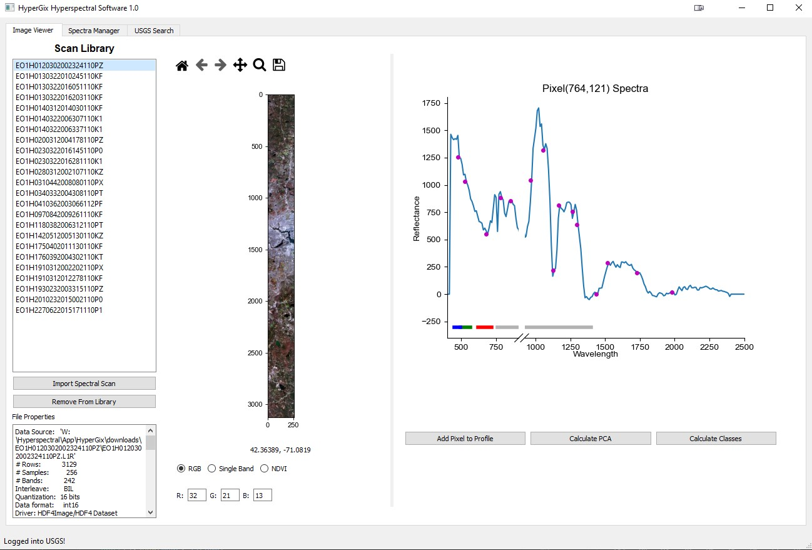
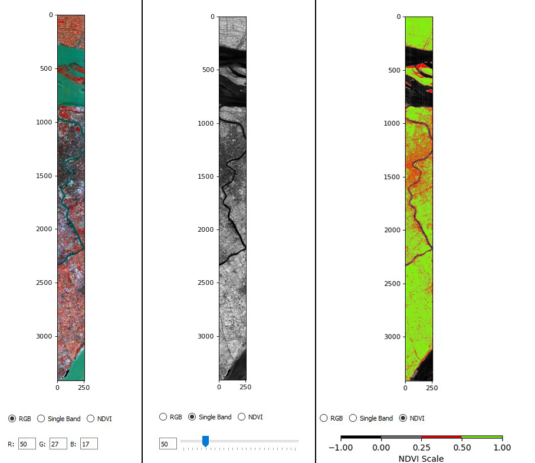
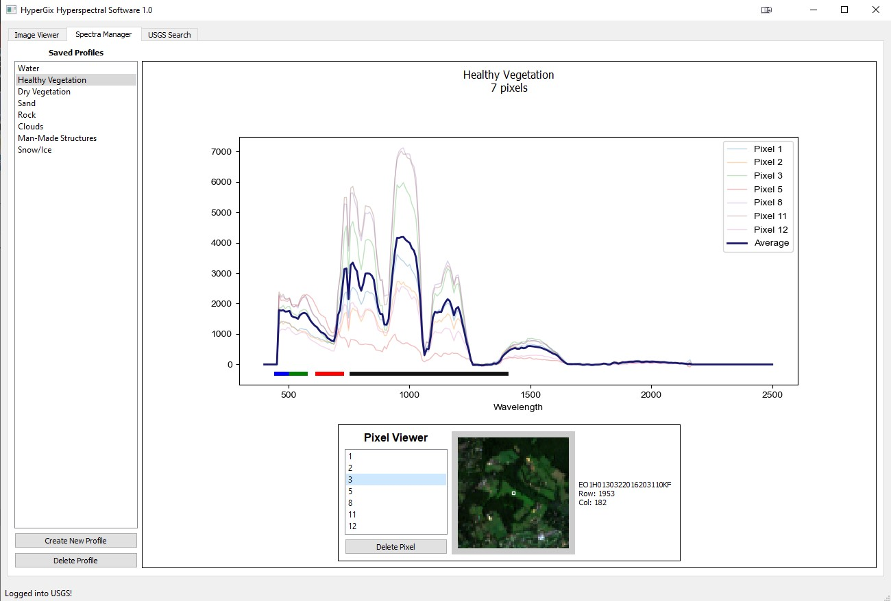
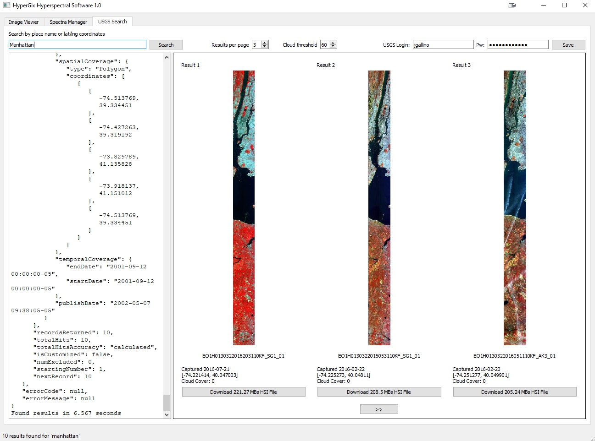

## Hyperspectral Desktop Software
HyperGix is an open-source, user-friendly desktop application to experiment with and learn about hyperspectral imagery. It is written in Python 3 and uses the PyQt5 GUI framework for its interface. It provides a sandbox environment to view and analyse hyperspectral images and spectral profiles, and includes a simple browser to download hyperspectral images from the USGS servers if the user does not have any of their own.

## Table of Contents
* [What is Hyperspectral Imaging?](#what-is-hyperspectral-imaging)
* [HyperGix Introduction](#hypergix-introduction)
* [Technologies Used](#technologies-used)
* [Features](#features)
* [Screenshots](#screenshots)
* [Setup](#setup)
* [Project Status](#project-status)
* [Acknowledgements](#acknowledgements)
* [Contact](#contact)
<!-- * [License](#license) -->

## What is Hyperspectral Imaging?
Hyperspectral imaging (HSI) is an advancement within spectral imaging, which is an analytical technique that combines imaging and spectroscopy information. Rather than capturing light in a few choice frequency ranges, hyperspectral sensors aim to capture reflectance values across a wide and continuous expanse of the electromagnetic (EM) spectrum that expands well beyond the visible light range and into the near infrared and shortwave infrared frequency ranges.

Hyperspectral images are sometimes represented as a "cube", with the x and y dimensions representing spatial information and the z dimension showing EM frequency. 

 Different materials have a unique reflectance pattern, like a fingerprint. A material like silica reflects energy across the EM spectrum in a very different way than water vapor, soil, or iron. Thus, by utilizing hyperspectral imaging sensors, scientists can log these patterns – referred to as spectral signatures – from known material samples, store them in a database known as a spectral library, and then refer to that database in the future to identify unknown materials in the field. 

## HyperGix Introduction
HyperGix is an open-source, user-friendly desktop application to experiment with and learn about hyperspectral imagery, created as a master's project in collaboration with Dr. Stefan Robila at Montclair State University. It is written in Python 3 and uses the PyQt5 GUI framework for its interface, with a SQLite database on the backend.

HyperGix aims to be intuitive and easy to use, with little instruction necessary. Presently it consists of three modules: Image Viewer, Spectra Manager, and USGS Search.  Using HyperGix, the user can organize and view hyperspectral files downloaded to their system, in either RGB (red, green, blue), single-band or Normalized Difference Vegetation Index (NDVI) views. The user may also perform Principal Component Analysis (PCA) on an image, define custom material classes and assign individual pixels from hyperspectral images to those classes to create a training set for classification tasks.
	
If the user does not have access to hyperspectral files, or is inexperienced in where to find them, the USGS Search interface allows them to simply search for a geolocation and browse available hyperspectral scans to download from the United States Geological Society’s database of Hyperion satellite scans captured from the years 2000 to 2017. However, the USGS interface is cumbersome and difficult to navigate. By using HyperGix, and its user-friendly Google Maps-based interface, the data access is significantly improved.

HyperGix is in early stages and may still contain bugs. It has been tested on Windows 10 and Mac OS, and requires installation of [GDAL](http://gdal.org) to run. A simple guide to installing GDAL on Windows 10 can be found [here](https://towardsdatascience.com/python-and-gdal-installation-automated-for-windows-10-f22686595447).

## Technologies Used
- Python 3.8.5
- PyQt 5.9.2
- GDAL 3.0.2
- Spectral Python 0.22.2
- Matplotlib 3.4.3
- Numpy 1.21.2

## Features

- Open and examine hyperspectral image files in the following formats: .lan, .hd4, .L1R, .tif, .hd5
- Three views available: RGB representation, single band, or NDVI
- Plot and save spectral signatures of individual pixels
- Create custom material profiles and then use them to classify pixels in other images
- Browse and download Hyperion hyperspectral satellite scans from USGS servers

## Screenshots

## Setup
GDAL should be installed on the user's system first. Run `gdalinfo --version` in terminal to see if it is already present on your machine. If not, visit [gdal.org](gdal.org) or search for a guide to install it on your machine. A simple guide to installing GDAL on Windows 10 can be found [here](https://towardsdatascience.com/python-and-gdal-installation-automated-for-windows-10-f22686595447).

Package dependencies are listed in requirements.txt or conda_env_windows.yml and conda_env_mac.yml depending on your OS.

To use the requirements.txt file, first clone the repo, then navigate to the repo directory and run `pip3 install -r requirements.txt` followed by `python hypergix.py`

Alternatively, to run HyperGix using Conda and the included yml files, first clone the repo to your computer, then use the following commands to create a conda environment

	conda env create -f <path_to_yaml_file>
	conda activate <environment_name>
	python <path_to_hypergix.py>

## Project Status
Project is:  _in progress_ 

<!-- ## Room for Improvement
Include areas you believe need improvement / could be improved. Also add TODOs for future development.

Room for improvement:
- Improvement to be done 1
- Improvement to be done 2

To do:
- Feature to be added 1
- Feature to be added 2 -->

## Acknowledgements
Give credit here.
- This project was inspired in part by [MultiSpec](github.com/larrybiehl/MultiSpec)
- This project was created under guidance from [Dr. Stefan Robila](https://www.montclair.edu/profilepages/view_profile.php?username=robilas) of Montclair State University

## Contact
Created by [@johngallino](https://github.com/johngallino) - feel free to contact me!

---

### :man_technologist: About Me :
I am a part-time developer  from New Jersey.

- :camera: I work as a photographer primarily and have been shooting professionally since 2006.

- :scroll: Recently received my Master's in Computer Science from Montclair State University

- :zap: In my free time, I watch a lot of developer YouTube and spend too much time on Reddit.

- :mailbox:How to reach me: 

<!-- Optional -->
<!-- ## License -->
<!-- This project is open source and available under the [... License](). -->
